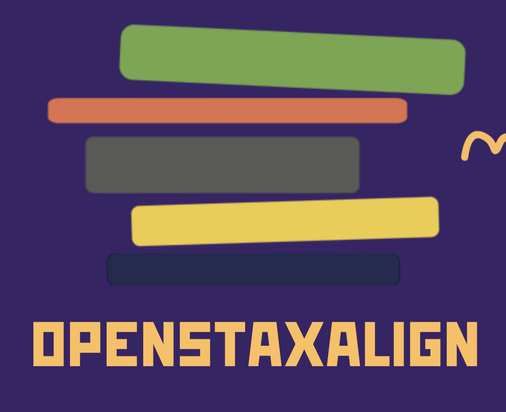
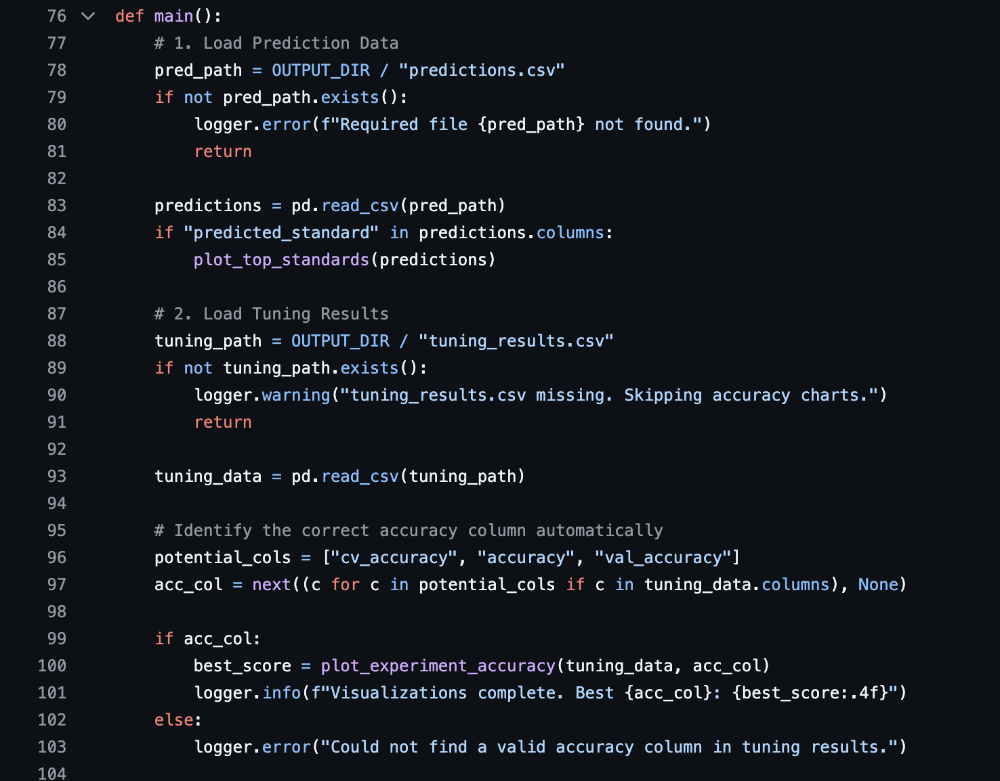
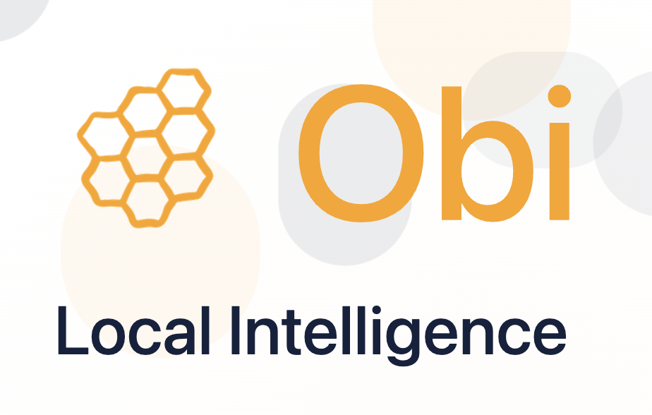
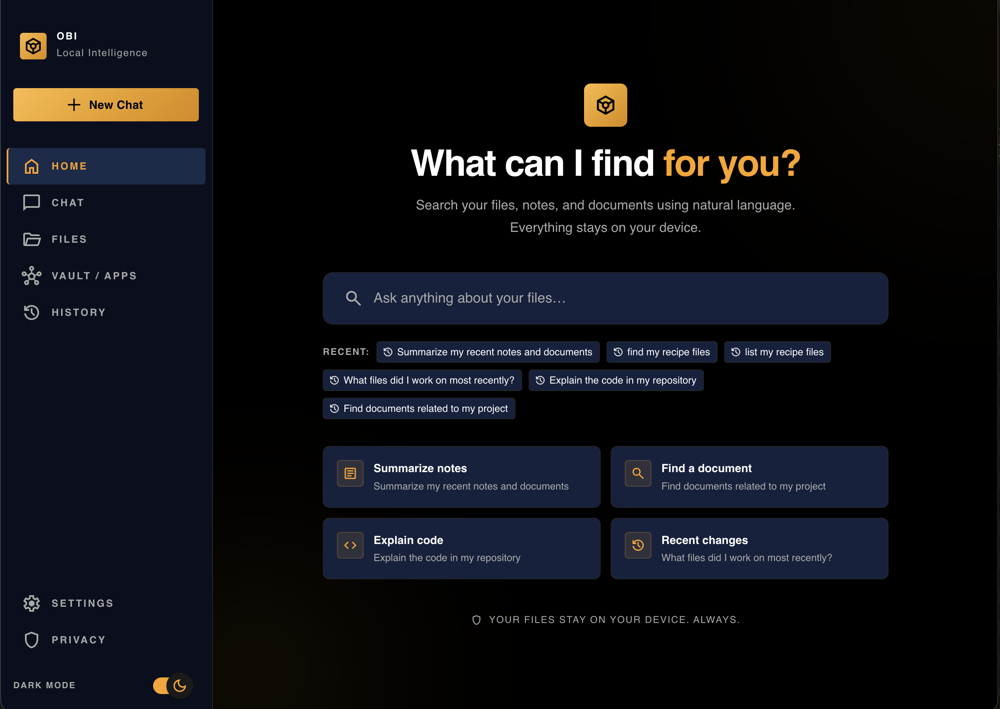
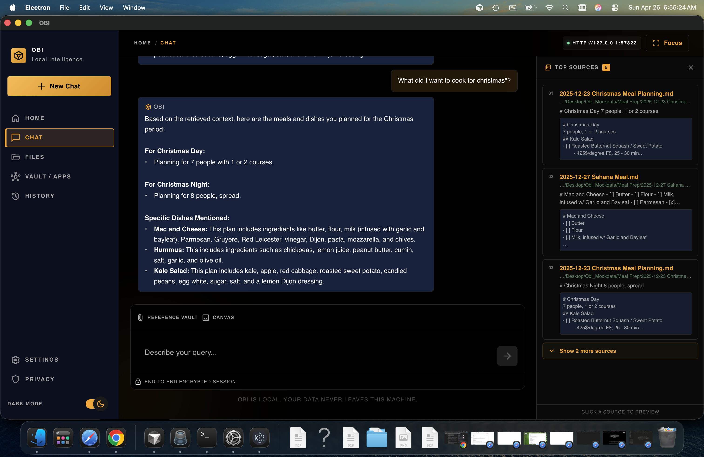

<p align="center">
  
</p>

<h1 align="center">Ayse Sule Ekiz — Portfolio</h1>

<p align="center">
  A hand-crafted personal portfolio spanning <strong>software engineering, visual art, ceramics, painting, and graphic design</strong> — with a fully integrated art print shop powered by Stripe.<br>
  Built entirely with vanilla HTML, CSS, and JavaScript — no framework, no build step, no runtime dependencies.
</p>

<p align="center">
  <a href="https://aysesule2405.github.io/ayse-sule-ekiz-portfolio/">Live Site</a> &nbsp;·&nbsp;
  <a href="#pages">Pages</a> &nbsp;·&nbsp;
  <a href="#art-print-shop">Print Shop</a> &nbsp;·&nbsp;
  <a href="#projects-showcased">Projects</a> &nbsp;·&nbsp;
  <a href="#interactive-mini-games">Mini-Games</a> &nbsp;·&nbsp;
  <a href="#run-locally">Run Locally</a>
</p>

---

## Highlights

- **Zero build step** — open any `.html` file directly in a browser or serve statically
- **Art print shop** — 30 original artworks available in 3 sizes, with Stripe-hosted checkout and post-purchase redirect
- **Full light / dark mode** — CSS custom properties, `localStorage` persistence, OS preference detection, and instant favicon swap
- **Three interactive mini-games** — a physics sand canvas, a color palette quiz, and a lunar memory game
- **Masonry galleries** — pure CSS `column-count`, no JS layout library
- **Web Audio sound design** — synthesised game sounds + fade-in/out MP3 loops, global mute
- **Accessible markup** — semantic HTML5, ARIA labels, keyboard navigation, scroll-reveal animations

---

## Pages

| Page | Description |
|---|---|
| `index.html` | Landing page — animated hero, editorial art preview, tools showcase |
| `projects.html` | Technical project cards with expandable detail pop-ups |
| `playground.html` | Three interactive mini-games |
| `about.html` | Personal story, background, and contact form (+ shop CTA) |
| `resume.html` | Inline résumé viewer with download link |
| `graphicdesign.html` | Graphic design & digital art gallery (masonry) + shop CTA |
| `ceramics.html` | Sculpting & ceramics gallery + shop CTA |
| `painting.html` | Painting & charcoal gallery + shop CTA |
| `shop.html` | Art print shop — 30 prints × 3 sizes, Stripe checkout |
| `success.html` | Post-purchase confirmation page |

---

## Art Print Shop

**[shop.html](shop.html)** is a full storefront built directly into the static site — no server required.

### How it works

Purchases use **Stripe Payment Links** — pre-built hosted checkout pages that require zero server-side code. Each link is a unique URL that:
1. Collects the customer's shipping address (US domestic)
2. Processes payment securely on Stripe's infrastructure
3. Redirects back to `success.html` after a completed purchase

### Available prints

| Category | Items | Edition |
|---|---|---|
| Paintings | Girl & Moon, Pastel #1 & #2, Angel & Moon, The Hike, Night Sea, Venus After Botticelli, Unraveling | Limited (20–30) |
| Printmaking (Monotypes) | Rain: Monotype Print #1, After Rain: Monotype Print #2, Freeform Monotype | Open edition |
| 2D Art Portfolio | Reaching to the Grapes, Women Gathered, From My Mother's Hands, From My Hands, Imece, Setting the Table, Carpet | Open edition |
| Poster Designs | Chambers, Forgotten, Four Seasons, Juicy Skies, Lilith, The Willow Maid, Monocro No Kiss, The Mystic's Dream, 134340, Nantes, The Truth Untold, Wolven Storm | Open edition |

### Pricing

| Size | Price |
|---|---|
| 5×7" | $10 |
| 8×10" | $20 |
| 11×14" | $30 |

### Stripe setup

Payment links live in `scripts/` (gitignored). To regenerate them (e.g. when switching from test → live mode):

```bash
cd scripts
npm install        # installs stripe SDK
node reprice.js    # creates products + prices + payment links, prints new URLs
```

Then paste the output URLs into `shop.html` buy-row `href` attributes. The secret key stays in `scripts/` and is never committed.

> **Test vs Live:** All current links use Stripe test mode (`buy.stripe.com/test_…`). Replace with live-mode links before going public.

### Shop entry points

The shop is intentionally not in the main navigation. Instead, each art page and the About page end with a **"Did anything catch your eye?"** CTA banner that links to `shop.html` and `about.html` (for commission requests).

---

## Projects Showcased

###  OpenStaxAlign — Rice Datathon 2026
**OpenStax Track Winner · 2nd Place Overall**



An NLP pipeline that maps textbook sections to educational standards automatically. Built end-to-end in a single hackathon day: raw JSON ingestion → TF-IDF vectorization → class-weighted Linear SVM → stratified cross-validation. Achieved **75% validation accuracy** on a severely imbalanced multi-class label space.

**Stack:** Python · scikit-learn · TF-IDF · Linear SVM · MongoDB · Logistic Regression

---

###  Obi — Local AI Desktop Assistant
**LA Hacks 2026 · Figma UI Challenge Winner**

| Homepage | Chat & Search |
|---|---|
|  |  |

Cross-platform AI desktop assistant with a locally-hosted Gemma LLM, sub-second contextual responses, and zero cloud dependency.

**Stack:** Electron · Vite · Gemma LLM · RAG Pipeline · Local AI

---

###  Whisperwind Grove — CS Senior Capstone


| Delivery on the Wind | Rise of the Half Moon | Spirit Drift | Spirit Sapling |
|---|---|---|---|
|  |  |  |  |

Full-stack capstone platform with four playable worlds, achievements, leaderboards, and AI-assisted interactions. Received full marks for systems integration.

**Stack:** React · TypeScript · Phaser · Gemini AI

---

###  Reverie — Social Reading App

| Home | My Spaces | Community | Timeline |
|---|---|---|---|
|  |  |  |  |

Mobile-first social platform for readers — curated reading spaces, community threads, personal timelines, and a saved-books library.

**Stack:** React Native · Node.js · Express · MongoDB · JWT Auth

---

###  Ghibli Guardians — Data Dashboard

| Dashboard | Statistics | Mobile |
|---|---|---|
|  |  |  |

Analytics dashboard styled around Studio Ghibli's visual language, built to explore environmental and ecological data.

**Stack:** React · D3.js · Node.js · PostgreSQL · Tailwind CSS

---

###  NAU Portal — University Platform

| Dashboard | Statistics |
|---|---|
|  |  |

Student portal consolidating course management, academic statistics, and campus resources into one cohesive interface.

**Stack:** React · Node.js · PostgreSQL · REST API · Tailwind CSS

---

## Interactive Mini-Games

### Half Moon
A lunar memory game. All 8 moon phase cards are revealed for a brief memorisation window, then flip face-down. The player must tap them back in correct lunar order from memory.

### Palette Oracle
A color intuition quiz. Each round presents a 5-swatch palette with one color hidden — the player picks which of four options completes the palette's story. 100+ handcrafted palettes.

### Sand Canvas
A real-time falling-sand physics simulation. 1 px grains in a `Uint32Array` grid, 6 physics substeps per frame, Gaussian spray brush, gradient mode, shake, and PNG export.

---

## Tech Stack

| Layer | Technology |
|---|---|
| Markup | HTML5 — semantic elements, ARIA roles and labels throughout |
| Styling | CSS3 · Tailwind CSS (CDN) · CSS custom properties for theming |
| Scripting | Vanilla JavaScript — no framework, no bundler |
| Payments | Stripe Payment Links (static, no server required) |
| Audio | Web Audio API (synthesised SFX) · HTML Audio (MP3 loops) |
| Icons | Streamline Freehand & Ultimate (PNG) · Lucide · Iconify |
| Fonts | Playfair Display · Inter (Google Fonts) |
| Contact | Web3Forms API |
| Hosting | GitHub Pages |

---

## Theming

Full **light / dark mode** with `localStorage` persistence and OS preference detection. CSS custom properties in `styles/main.css`:

| Token | Light | Dark |
|---|---|---|
| `--color-accent` | `#941b0c` crimson | `#FFA618` amber |
| `--color-bg` | `#fff7ed` cream | `#020617` |
| `--color-surface` | `#fffdf9` | `#0f172a` |
| `--color-text` | `#2a120c` | `#ffffff` |

---

## Project Structure

```
ayse-sule-ekiz-portfolio/
├── index.html
├── projects.html
├── playground.html
├── about.html
├── resume.html
├── graphicdesign.html
├── ceramics.html
├── painting.html
├── shop.html                     # Art print shop (30 prints × 3 sizes)
├── success.html                  # Post-purchase + contact form confirmation
│
├── styles/
│   ├── main.css
│   ├── cards.css
│   ├── animations.css
│   └── nav-dropdown.css
│
├── js/
│   ├── portfolio-mini-games.js
│   ├── half-moon-game.js
│   ├── sfx.js
│   ├── theme-toggle.js
│   └── scroll-animations.js
│
├── images/
│   ├── paintings/
│   ├── dijital_art/
│   ├── graphic_design/
│   └── ceramics/
│
├── scripts/                      # gitignored — Stripe setup scripts + node_modules
│   ├── setup-stripe.js           # Initial 21-print setup
│   ├── setup-stripe-new.js       # Added 14 new prints
│   └── reprice.js                # Repriced all 30 prints ($10/$20/$30)
│
└── projects/
```

---

## Run Locally

No build step required:

```bash
python3 -m http.server 8000
# or
npx serve .
```

Open `http://localhost:8000`.

---

## Going Live with Stripe

1. Create a live-mode Stripe account and get your live secret key
2. Update the key in `scripts/reprice.js`
3. Run `node reprice.js` — this creates live products + payment links
4. Replace all `buy.stripe.com/test_…` URLs in `shop.html` with the live URLs
5. Update `success.html` redirect URL in the script to your production domain
